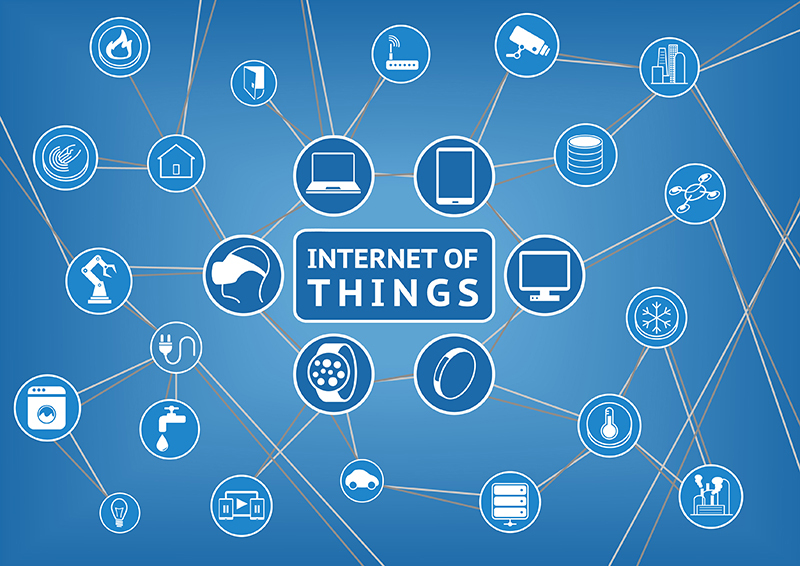
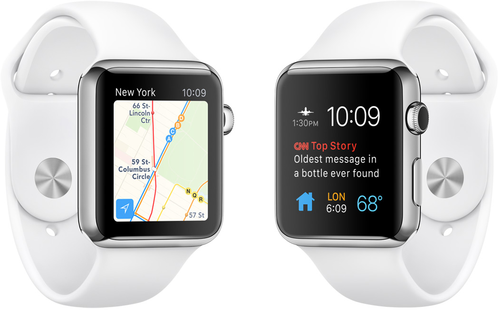
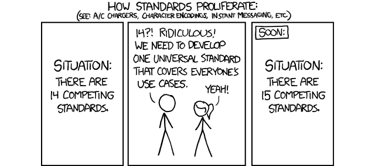

.. Internet de las Cosas slides file, created by
   hieroglyph-quickstart on Tue Dec  1 14:31:00 2015.

Internet de las Cosas
=====================

.. image:: _static/movile.png

.. rst-class:: date

   2 de Diciembre del 2.015

Conceptos
=========

¿Qué es?
--------

* Concepto: Cualquier cosa puede conectarse a Internet
* Acuñado por Kevin Ashton en 1.999 en MIT
* Objetivo: **independencia**

.. rst-class:: center

   .. figure:: _static/kevin.jpeg
      :class: image-30
      :alt: Kevin Ashton picture
   
      Kevin Ashton

.. note::

   Es un concepto propuesto por Kevin Ashton en 1.999 que establece que
   cualquier cosa puede conectarse a Internet con el objetivo de hacerlos más
   independientes de la intervención humana. También refiere a un punto en el
   futuro en que la cantidad de cosas conectadas a Internet superará a la
   cantidad de personas.

¿Por qué es importante?
-----------------------

* La información es creada por humanos

  .. rst-class:: center

     .. figure:: _static/problem1.jpg
        :class: image-30

* Información directa > monitoreo y decisiones.

  .. container:: center

     .. image:: _static/m2m.png
        :class: image-30

     .. image:: _static/decisions.jpg
        :class: image-30

.. note::

   Kevin Ashton, 2.009: "la mayor parte de la información en Internet fue
   creada por humanos presionando botones, escaneando códigos de barra, etc.
   Debido a que las computadoras saben más sobre ideas que sobre las mismas
   cosas, si pudiesen obtener información directamente de la fuente nos
   habilitaría a monitorizar y tomar decisiones.

Herramientas
============

Arduino
-------

.. container:: center

   .. figure:: _static/arduino.png
      :class: image-30
   
   .. figure:: _static/arduino316.jpg
      :class: image-50

.. note::

   Es una plataforma de hardware libre basada en una placa con un
   microcontrolador y un entorno de desarrollo diseñada para faciliar la
   electrónica.

Eclipse IoT
-----------

.. rst-class:: center

   .. figure:: _static/eclipse-iot.png
      :class: image-80

Raspberry Pi
------------

.. container:: center

   .. figure:: _static/raspberrypi.png
      :class: image-80

   .. figure:: _static/modelb.jpeg
      :class: image-80

.. note::

   Ordenador de placa única de bajo costo. 

Expectativas
============

Crecimiento
-----------

.. figure:: _static/2020.png
   :class: image-90

.. note::

   En el año 2.009 había menos de mil millones de *cosas* conectadas y se
   espera que para el 2.020 sean 26-30 mil millones, superando a la población
   mundial estimada en 7,7 mil millones.

Impacto social y económico
--------------------------

* Mayor pérdida de privacidad en ciudades altamente conectadas.
* Optimización del consumo de energía.
* Mejoras de procesos industriales.
* Reformulación de industrias: nuevos puestos de trabajo emergerán pero en 
  consecuencia otros dejarán de existir (similar a la revolución digital).

Ejemplos
========

Android Wear
------------

Apple Watch
-----------

Twine
-----

.. raw:: html

   <iframe class="video" src="https://player.vimeo.com/video/33192464" frameborder="0" allowfullscreen></iframe>

Matrix
------

.. raw:: html

   <iframe class="video" src="https://www.youtube.com/embed/xiTIHStZYYI" frameborder="0" allowfullscreen></iframe>

Kinoma
------

.. container:: center

   .. figure:: _static/kinoma.png
      :class: image-70

   .. figure:: _static/kinoma-hw.jpg
      :class: image-70

.. note::

   Es una plataforma de dispositivos electrónicos de alta performance.

Secret knock detecting lock
---------------------------

.. raw:: html

   <iframe class="video" src="https://www.youtube.com/embed/zE5PGeh2K9k" frameborder="0" allowfullscreen></iframe>

Problemas actuales
==================

Sin estándares definidos
------------------------

¿Dashboard?
-----------

.. rst-class:: center

   .. figure:: _static/ring.jpg
      :class: image-80

* La tecnología ideal aún está en fase de desarrollo.

¿Preguntas?
===========

Links
-----

* `Internet of Things Council <http://www.theinternetofthings.eu/>`_
* `Eclipse IoT <http://iot.eclipse.org/>`_
* `35 Open Source Tools for the Internet of Things <http://www.datamation.com/open-source/35-open-source-tools-for-the-internet-of-things-1.html>`_
* `"The Internet of Things Bussiness Index" by ARM <http://www.arm.com/files/pdf/EIU_Internet_Business_Index_WEB.PDF>`_
* `Twine by Supermechanical <http://supermechanical.com/twine/>`_
* `Kinoma by Marvell <http://www.marvell.com/kinoma/>`_
* `Kevin Ashton's Twitter <https://twitter.com/kevin_ashton>`_
* `Raspberry Pi <https://www.raspberrypi.org/>`_

¡Muchas gracias!
================

.. rst-class:: movile-thankyou

   .. image:: _static/movile.png

.. rst-class:: me

   Ariel Gerardo Ríos

.. rst-class:: personal-data

   |email|

.. rst-class:: personal-data

   |twitter|_

.. _twitter: https://twitter.com/ariel_17_
.. |twitter| replace:: @ariel_17_
.. |email| replace:: ariel.rios@movile.com
